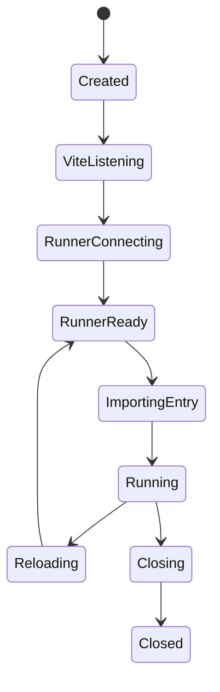

# Vite Environment API implementation notes

**Purpose:** compact reference of public Vite Environment API implementations that can inform the Titanium environment and plugins.

**Status:** research notes, not a design decision. Verify source APIs again before copying code; several examples target experimental Vite APIs and older `rollupOptions` names.

## Titanium baseline

Titanium currently has a narrow environment factory in `packages/vite-titanium-environment/src/environment.ts`:

- `createTitaniumEnvironment()` returns merged `EnvironmentOptions`.
- Dev uses `TitaniumDevEnvironment extends DevEnvironment` and overrides `fetchModule()` for Titanium builtins and optimized dependencies.
- Build uses `BuildEnvironment` with `consumer: "client"`, `target: "ios13"`, `platform: "neutral"`, CJS output, `noExternal: [/.*/]`, and explicit Titanium/Node-compat builtins.
- Runtime execution is bridged by `titanium:module-runner`, which emits a Titanium-side `ModuleRunner` bootstrap and proxies `/invoke` back to Vite.

That makes the closest analogues "custom runtime provider" projects, not framework-only plugin examples.

## Source map

| Project                      | Source                                                                                                                                                                                                                                                                                                                                                                                                            | Relevant shape                                                                                                                                              |
| ---------------------------- | ----------------------------------------------------------------------------------------------------------------------------------------------------------------------------------------------------------------------------------------------------------------------------------------------------------------------------------------------------------------------------------------------------------------- | ----------------------------------------------------------------------------------------------------------------------------------------------------------- |
| Cloudflare Workers SDK       | [`packages/vite-plugin-cloudflare/src/cloudflare-environment.ts`](https://github.com/cloudflare/workers-sdk/blob/07336888e0bc82925e4023f5b72a0062f10d77b8/packages/vite-plugin-cloudflare/src/cloudflare-environment.ts)                                                                                                                                                                                          | Production runtime provider with custom `DevEnvironment`, WebSocket hot channel, Miniflare runner init, environment-specific resolution/build/optimization. |
| hi-ogawa workerd examples    | [`packages/workerd/src/plugin.ts`](https://github.com/hi-ogawa/vite-environment-examples/blob/2da75728e3a557efaf4ee4d755206784129a49ad/packages/workerd/src/plugin.ts)                                                                                                                                                                                                                                            | Minimal workerd provider showing how little plugin surface is needed when the environment exposes a useful `api`.                                           |
| vite-plugin-workerd          | [`src/plugins/dev-environment.ts`](https://github.com/edmundhung/vite-plugin-workerd/blob/69c7d58f7712dad0e76b80a5fc25e1f939b9a634/src/plugins/dev-environment.ts)                                                                                                                                                                                                                                                | More defensive workerd hot-channel implementation with buffering, attach/detach lifecycle, `skipFsCheck`, and separate loader environment.                  |
| Netlify Environment Provider | [`packages/vite-environment-provider-netlify/src/index.ts`](https://github.com/netlify/netlify-vite-environment/blob/f4c2e77d832b3f33df57d2a30bdc8de0a4ab5ca7/packages/vite-environment-provider-netlify/src/index.ts), [`runtime-bridge.ts`](https://github.com/netlify/netlify-vite-environment/blob/f4c2e77d832b3f33df57d2a30bdc8de0a4ab5ca7/packages/vite-environment-provider-netlify/src/runtime-bridge.ts) | Deno-backed dev runtime using a Node host bridge and a typed environment `api.getHandler()`.                                                                |
| Shopify Hydrogen Mini Oxygen | [`plugin.ts`](https://github.com/Shopify/hydrogen/blob/a666c141b78cc3f576e04e8bf0336939da8dd08f/packages/mini-oxygen/src/vite/plugin.ts), [`environment.ts`](https://github.com/Shopify/hydrogen/blob/a666c141b78cc3f576e04e8bf0336939da8dd08f/packages/mini-oxygen/src/vite/environment.ts)                                                                                                                      | `createFetchableDevEnvironment()` wrapper with lazy runtime startup, runtime option registration, and deterministic disposal.                               |
| Nitro                        | [`src/build/vite/env.ts`](https://github.com/nitrojs/nitro/blob/14f2fed317a5488572380dbd8bf3dd0c69238818/src/build/vite/env.ts)                                                                                                                                                                                                                                                                                   | Multi-runtime provider using `env-runner`, fetchable environments, service environments, runner reloads, and cross-environment proxy modules.               |
| vite-plugin-vercel           | [`packages/vite-plugin-vercel/src/plugins/setupEnvs.ts`](https://github.com/magne4000/vite-plugin-vercel/blob/cc31f31b58287896d0a22b55eee140a1c133366f/packages/vite-plugin-vercel/src/plugins/setupEnvs.ts)                                                                                                                                                                                                      | Deployment adapter using multiple environments, `buildApp`, dummy inputs, `sharedDuringBuild`, and `applyToEnvironment`.                                    |
| Astro                        | [`packages/astro/src/core/fetch/vite-plugin.ts`](https://github.com/withastro/astro/blob/c8e5a943579edd9223041e40fc7151d1caf4e0cd/packages/astro/src/core/fetch/vite-plugin.ts)                                                                                                                                                                                                                                   | Framework plugin scoping hooks to named environments and invalidating module graphs per environment.                                                        |
| TanStack Router / Start RSC  | [`packages/react-start-rsc/src/plugin/vite.ts`](https://github.com/TanStack/router/blob/e2896b5051334913e78792ca39f01e848262b17d/packages/react-start-rsc/src/plugin/vite.ts)                                                                                                                                                                                                                                     | RSC environment configuration, consumer-based plugin scoping, and virtual modules that fail explicitly outside their intended environment.                  |
| Vite docs                    | [Environment API for Runtimes](https://vite.dev/guide/api-environment-runtimes), [Environment API for Frameworks](https://vite.dev/guide/api-environment-frameworks), [Environment API for Plugins](https://vite.dev/guide/api-environment-plugins), [feedback discussion](https://github.com/vitejs/vite/discussions/16358)                                                                                      | Canonical concepts: environment factories, communication levels, `buildApp`, `applyToEnvironment`, shared build plugins.                                    |

## Patterns worth borrowing

### 1. Environment factory as the public integration point

Cloudflare, Netlify, and Titanium all expose a function returning `EnvironmentOptions`. This keeps user config concise and lets the provider set runtime defaults in one place.

For Titanium, keep this as the main seam. Any future Alloy or CLI-specific defaults should merge into `createTitaniumEnvironment()` or a clearly named variant, not leak as scattered top-level Vite config.

Useful defaults to continue centralizing:

- `resolve.conditions`, `resolve.builtins`, `resolve.external`, and `resolve.noExternal`
- `optimizeDeps` behavior for module runner dependency fetches
- `build.target`, `build.outDir`, `build.copyPublicDir`, and Rolldown output format
- dev/build `createEnvironment()` construction

### 2. Custom environment `api` beats plugin-to-plugin guessing

Several providers attach a typed API to the dev environment:

- hi-ogawa exposes `api.dispatchFetch(entry, request)`.
- Netlify exposes `api.getHandler({ entrypoint })`.
- Hydrogen exposes `configureRuntime(options)` on the environment.

Titanium already has a bridge plugin API for CLI context. The environment side could mirror the same idea when plugins need runtime operations. A typed `TitaniumDevEnvironmentApi` would be cleaner than having plugins know about `/invoke`, `server.environments[name]` internals, or virtual bootstrap details.

Candidate shape:

```ts
export interface TitaniumDevEnvironmentApi {
  importEntry(id: string): Promise<void>;
  fetchModule(id: string, importer?: string): Promise<unknown>;
  dispatchInvoke(payload: unknown): Promise<unknown>;
}
```

Do not copy the examples' loose typing. Netlify uses `config: any`; Nitro uses casts around bundler config. This repo's standard should keep boundary parsers and concrete return types.

### 3. Runtime bridge lifecycle needs explicit states

Workerd implementations are useful because their runner is not the Vite process:

- Cloudflare buffers hot-channel messages until the WebSocket exists.
- vite-plugin-workerd tracks `listening`, `attached`, and buffered messages separately.
- Hydrogen deduplicates concurrent first requests and prevents runtime option changes after startup.
- Netlify splits host startup, runner startup, runner registration, and entrypoint bootstrap.

Titanium dev has the same class of problem: code executes inside a Titanium runtime while Vite stays in Node. Treat the bridge as a state machine instead of incidental callbacks.

States to model explicitly:



This matters for missed HMR/invoke messages, server restarts, app relaunches, and stale CLI bridge context.

### 4. Prefer fetch-style request APIs for runtime-agnostic dev

Vite's current docs and newer implementations point toward `createFetchableDevEnvironment()` where possible. Hydrogen and Nitro use fetchable environments so frameworks can call `dispatchFetch()` without knowing the runtime transport details.

Titanium is not HTTP-native, but its existing `Ti.Network.createHTTPClient` bridge already moves messages over HTTP. A fetch-like abstraction around `/invoke` would make the dev runner easier to test and would align with the ecosystem pattern.

Practical target:

- keep Titanium-specific transport inside the environment/plugin package;
- expose request-shaped APIs to higher-level plugins;
- make module fetch, invoke, and reload operations observable separately.

### 5. Per-environment plugin scoping should become the default

Astro, Vercel, Nitro, and TanStack use `applyToEnvironment()` and `this.environment` to avoid hooks running in the wrong graph.

Titanium plugins already have classic/alloy/runtime concerns that should not all apply everywhere. When adding more hooks, prefer:

- `applyToEnvironment(env) { return env.name === "titanium"; }`
- `this.environment.name` checks inside hook bodies only when one hook genuinely serves multiple environments
- `consumer` checks for generic client/server behavior

Avoid relying on global Vite config flags inside hooks when the hook is environment-specific.

### 6. Multi-output builds need `buildApp`, not incidental hook ordering

vite-plugin-vercel demonstrates the pattern for building client/edge/node outputs from one app command:

- inject named environments in `config`;
- set `builder: {}` so environments participate in app build;
- use `buildApp` to orchestrate environment build order;
- use per-environment cleanup plugins for emitted artifacts.

Titanium may need this if classic app, Alloy-generated entries, platform-specific resources, or symbol reports become separate environment builds. Do not overload one environment with unrelated outputs if the artifacts have different runtime assumptions.

### 7. Dependency processing is runtime policy

Cloudflare and Nitro both force more dependencies through Vite for worker-like runtimes because CJS externals and Node conditions break in those runtimes. Titanium is similar:

- no host module loader for npm dependencies;
- no native ESM script evaluation in the current runtime path;
- builtins must be explicit;
- package export conditions must reflect Titanium's runtime constraints.

Keep dependency behavior in the environment's `resolve` and `optimizeDeps` defaults. Ad hoc plugin fixes will be copied and drift.

### 8. Cross-environment imports should be explicit virtual contracts

Nitro's service proxy and TanStack's RSC virtual modules are useful examples:

- proxy modules make cross-environment imports visible;
- wrong-environment usage fails with deliberate runtime errors;
- environment-specific virtual modules can return different implementations per environment.

For Titanium, this pattern fits:

- `virtual:titanium/main`
- `virtual:titanium/module-runner`
- potential Alloy controller/model/view runtime shims
- future platform-specific virtual modules

Do not silently return Node fallbacks when code is only valid inside Titanium. Failing explicitly is better.

## Challenges to investigate for Titanium

1. **Hot channel vs invoke-only transport.** Current dev runner disables HMR and posts `/invoke`. Cloudflare/workerd examples show a real `HotChannel`. Decide whether Titanium can support a minimal hot channel for reload/invalidation events, or whether invoke-only should be formalized.
2. **Bridge state ownership.** Today state is split between bridge plugin context, dev server middleware, and generated module-runner code. Consider a single typed bridge state object owned by the Titanium environment.
3. **Fetchable environment feasibility.** Prototype whether `createFetchableDevEnvironment()` can wrap the Titanium runner without forcing HTTP semantics onto app code.
4. **Environment naming.** If multiple Titanium targets appear (`ios`, `android`, `alloy`, `classic`), decide whether these are separate Vite environments or options on one `titanium` environment.
5. **Per-environment plugin hygiene.** Audit plugin hooks and add `applyToEnvironment()` where hooks should only affect Titanium graphs.
6. **Build orchestration.** If platform-specific outputs diverge, move toward `buildApp` instead of encoding all outputs in one Rolldown config.
7. **Typed public APIs.** Define narrow ADTs for bridge messages and environment APIs before adding more runtime commands.

## Anti-patterns found in references

- `any` and broad casts around `ResolvedConfig`, bundle config, or transport payloads. Useful for prototypes, wrong default here.
- Stale `rollupOptions` examples. Titanium is already on Vite 8/Rolldown; prefer `rolldownOptions` unless using a documented compatibility path.
- Plugin hooks that rely on global config when they actually target one environment.
- Runtime startup hidden in first unrelated hook. Prefer explicit `listen()`, `close()`, bootstrap, and reload lifecycle methods.

## Immediate next-use checklist

When changing the Titanium environment or runtime plugins, check the relevant pattern first:

- Runtime bridge or message buffering: Cloudflare, vite-plugin-workerd, Netlify.
- Fetch/request dispatch shape: Hydrogen, Nitro, hi-ogawa workerd.
- Dependency bundling/runtime conditions: Cloudflare, Nitro.
- Multi-output build: Vercel.
- Per-environment hook scoping: Astro, TanStack, Nitro, Vercel.
- Cross-environment virtual modules: Nitro, TanStack.
